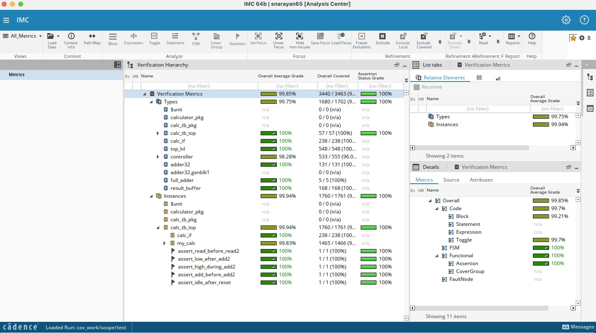

# SiliconJackets-onboarding
Sneha Narayan's SiliconJackets Onboarding Project

64-bit SystemVerilog RTL calculator with FSM control, 32-bit ripple-carry addition, and SRAM sequencing. 
The verification folder contains SystemVerilog testbench with constrained-randomized tests/assertions; achieved 99.85% coverage in Cadence IMC (shown below).

